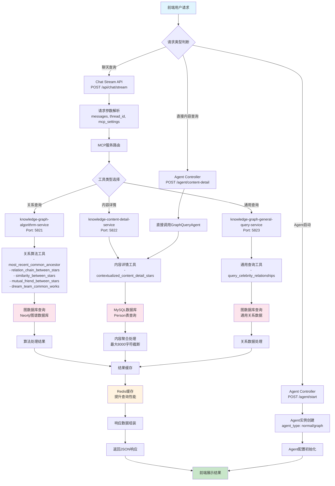
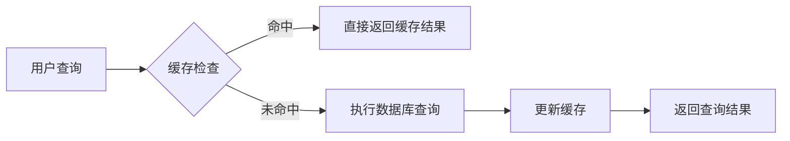
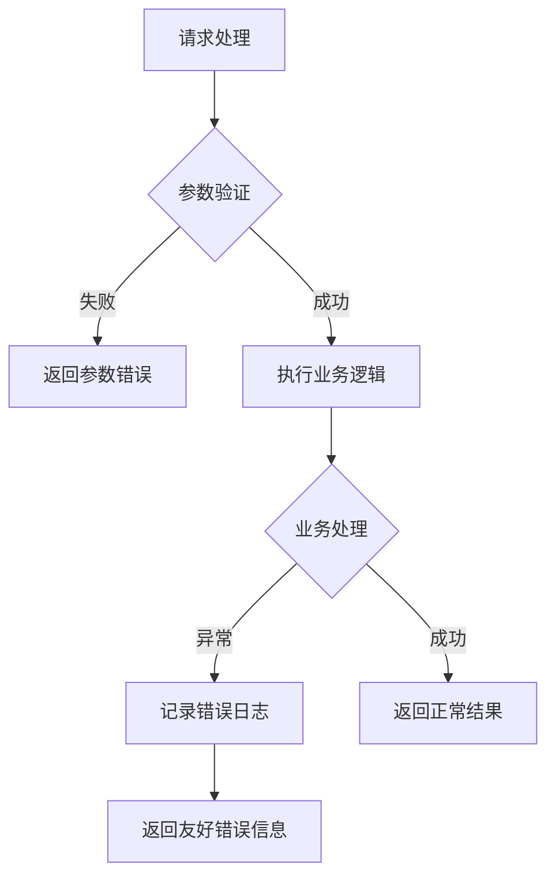

# 图谱Agent业务流程图

## 系统架构概述

本系统采用多服务MCP（Model Control Protocol）架构，通过Spring AI框架实现智能图谱查询功能。

## 完整业务流程图

## 详细流程说明

### 1. 请求入口层
- **Chat Stream API**: 支持流式对话，处理复杂的图谱查询请求
- **Agent Controller**: 提供RESTful接口，支持直接的内容查询和Agent管理

### 2. MCP服务架构
系统部署了三个专业化的MCP服务：

#### knowledge-graph-algorithrm-service (端口5821)
- 专门处理图谱算法查询
- 支持共同好友、关系链、相似度分析等算法

#### knowledge-content-detail-service (端口5822)
- 当前项目实现的服务
- 专注于人员新闻内容的详细查询

#### knowledge-graph-general-query-service (端口5823)
- 处理通用的图谱关系查询
- 提供基础的明星关系查询功能

### 3. 数据存储层
- **MySQL数据库**: 存储人员基础信息和新闻内容
- **图数据库**: 存储复杂的关系网络数据
- **Redis缓存**: 提升查询性能，缓存热点数据

### 4. 工具调用机制
通过Spring AI的@Tool注解实现：
- 自动工具发现和注册
- 基于用户查询意图的智能工具选择
- 跨服务的工具协调调用

### 5. 响应处理
- 结果聚合和格式化
- 智能截断（内容超过8000字符时）
- 统一的JSON响应格式

## 缓存策略

## 错误处理流程

